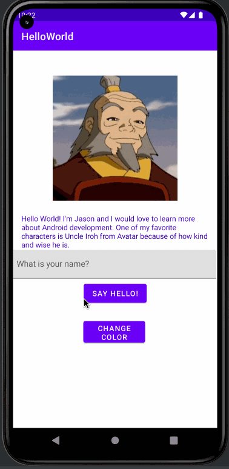

# Android Prework - *HelloWorld*

Submitted by: **Jason Wong**

**HelloWorld** is an android app that shows an image and introductory message, and allows pressing a button to display a Toast. 

Time spent: **6** hours spent in total

## Required Features

The following **required** functionality is completed:

* [x] Image and introductory message displayed on screen
* [x] Button displayed on screen
* [x] Toast with message appears when button is pressed 

The following **optional** features are implemented:

* [x] Button that can change the color of the text to magenta and cause a toast with message to appear.
* [x] User can input name into text field so that when "Say Hello!" button is pressed, it will say hello to the inputted name. If text field is empty, it will say default hello message. 

## Video Walkthrough

Here's a walkthrough of implemented features:

<!-- Replace this with whatever GIF tool you used! -->
GIF created with [LiceCap](http://www.cockos.com/licecap/).  
<!-- Other options include:
[Kap](https://getkap.co/) for macOS
[ScreenToGif](https://www.screentogif.com/) for Windows
[peek](https://github.com/phw/peek) for Linux. -->

## Notes

I had difficulties with pushing to Github through the terminal due to authorization issues. After searching up the issue, I found out that I had to use a token so I regenerated my token and put it in as the password which solved the issue. I had difficulties implementing the TextInputEditText for user input but I looked at CodePath's EditText and Soft Keyboard guides to figure out how to handle the user's input and how to make the keyboard disappear.
## License

    Copyright [2022] [Jason Wong]

    Licensed under the Apache License, Version 2.0 (the "License");
    you may not use this file except in compliance with the License.
    You may obtain a copy of the License at

        http://www.apache.org/licenses/LICENSE-2.0

    Unless required by applicable law or agreed to in writing, software
    distributed under the License is distributed on an "AS IS" BASIS,
    WITHOUT WARRANTIES OR CONDITIONS OF ANY KIND, either express or implied.
    See the License for the specific language governing permissions and
    limitations under the License.
